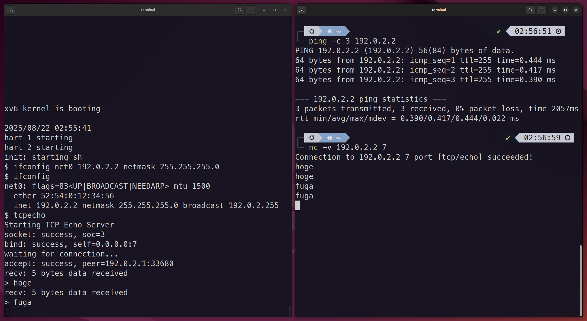

xv6-riscv-net
=======

This project integrates a TCP/IP protocol stack into the [xv6-riscv](https://github.com/mit-pdos/xv6-riscv) operating system, enabling network capabilities.

Key Components:

- **TCP/IP Stack**: A kernel-space port of [microps](https://github.com/pandax381/microps), a user-mode TCP/IP stack that I am also developing.

- **Network Driver**: A virtio-net driver for network device emulation in QEMU.

- **Socket API**: A standard socket interface for network applications.

- **Network Configuration**: A simple `ifconfig` command for basic network settings.



## Quick Start

### 1. Build and Run

Clone the repository and use the `make qemu` command.

```shell
$ git clone https://github.com/pandax381/xv6-riscv-net
$ cd xv6-riscv-net
$ make qemu
```

> [!NOTE]
> This command will build the project and launch QEMU. On the first run, it will also create a TAP network device named `tap0` on your host machine and assign it the IP address `192.0.2.1/24`. This enables network communication between the xv6 guest and the host.

### 2. Network Configuration in xv6

Once xv6 has booted, use the `ifconfig` command to configure the `net0` network interface. We'll assign it the IP address `192.0.2.2`, as the host is using `192.0.2.1`.

```shell
$ ifconfig net0 192.0.2.2 netmask 255.255.255.0
```

After setting the IP address, run the `ifconfig` command again to verify that the network settings have been applied.

```shell
$ ifconfig
net0: flags=93<UP|BROADCAST|RUNNING|NEEDARP> mtu 1500
        ether 52:54:00:12:34:56
        inet 192.0.2.2 netmask 255.255.255.0 broadcast 192.0.2.255
```

The setup is now complete. You can verify the communication by pinging the xv6 guest from a terminal on your host machine.

```shell
$ ping 192.0.2.2
PING 192.0.2.2 (192.0.2.2) 56(84) bytes of data.
64 bytes from 192.0.2.2: icmp_seq=1 ttl=255 time=0.444 ms
...
```

### 3. Running the Sample Programs

This project includes `tcpecho` and `udpecho` as sample user-level applications to demonstrate the network stack. Here is how to test the TCP echo server.

In the xv6 shell, run the `tcpecho` command. It will start a server listening on port `7`.

```shell
$ tcpecho
Starting TCP Echo Server
socket: success, soc=3
bind: success, self=0.0.0.0:7
waiting for connection...
```

Open a new terminal on your host machine and use `nc` (netcat) to connect to the tcpecho server running inside QEMU.

```
$ nc -v 192.0.2.2 7
```

Once the connection succeeds, type any message into the `nc` terminal and press Enter. The message will be sent to the xv6 `tcpecho` server, which will then echo it back to your terminal.

```
Connection to 192.0.2.2 7 port [tcp/echo] succeeded!
hoge
hoge
fuga
fuga
```

On the xv6 guest, `tcpecho` will output messages like the following after a connection is established and data is received:

```
accept: success, peer=192.0.2.1:33680
recv: 5 bytes data received
> hoge
recv: 5 bytes data received
> fuga
```

## License

xv6-riscv: Under the MIT License. See [LICENSE](./LICENSE) file.

Additional code: Under the MIT License.
